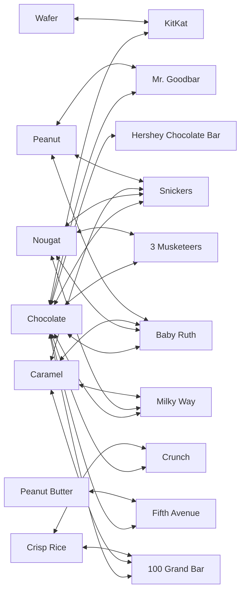

# CandyMaker

```mermaid
flowchart LR
%%  subgraph Ingredients
    Chocolate <--> hcb[Hershey Chocolate Bar]
    Chocolate <--> KitKat
    Chocolate <--> Snickers
    Chocolate <--> Crunch
    Chocolate <--> mg[Mr. Goodbar]
    Chocolate <--> tm[3 Musketeers]
    Chocolate <--> mw[Milky Way]
    Chocolate <--> br[Baby Ruth]
    Chocolate <--> ohgb[100 Grand Bar]
    Chocolate <--> fa[Fifth Avenue]
    Nougat <--> Snickers
    Nougat <--> tm
    Nougat <--> mw
    Nougat <--> br
    Caramel <--> Snickers
    Caramel <--> mw
    Caramel <--> br
    Caramel <--> ohgb
    Peanut <--> Snickers
    Peanut <--> mg
    Peanut <--> br
    cr[Crisp Rice] <--> Crunch
    cr <--> ohgb
    Wafer <--> KitKat
    pb[Peanut Butter] <--> fa
```
